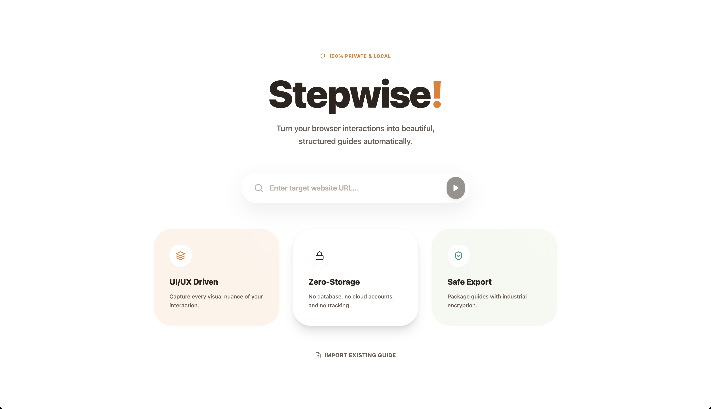
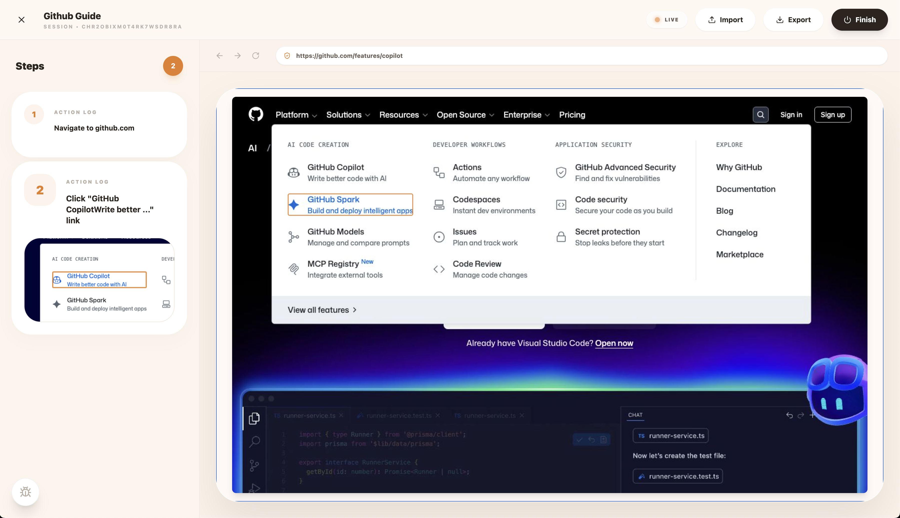

<div align="center">

[](https://github.com/asher935/Stepwise/#Stepwise)

[](https://github.com/asher935/Stepwise#Stepwise)


</div>

A Docker-deployable web application for recording browser actions into step-by-step guides with screenshots. Self-hosted alternative to Tango.ai.


## Features

- **Browser Recording**: Record clicks, typing, navigation, and scrolling in a remote browser
- **Screenshot Capture**: Automatic screenshots with element highlights for each step
- **Step Editing**: Edit captions and delete unwanted steps
- **Multiple Export Formats**: PDF, Word (DOCX), Markdown, HTML, and re-importable .stepwise format
- **Password Protection**: Encrypt exported .stepwise files
- **Import/Export**: Save and restore recording sessions
- **Real-time Streaming**: Low-latency browser view via Chrome DevTools Protocol

## Tech Stack

- **Frontend**: React 18 + Vite + TypeScript + Tailwind CSS + Zustand
- **Backend**: Bun + Elysia (WebSocket support)
- **Browser Control**: Playwright with Chrome DevTools Protocol
- **Export**: Playwright PDF, docx library for Word

## Getting Started

Choose one of the following methods to run Stepwise:

### 1. Local Development (Recommended for Development)

Run directly on your machine with hot-reload for rapid development.

**Prerequisites:**
- [Bun](https://bun.sh/) runtime (v1+)
- Node.js-compatible environment

**Steps:**

```bash
# Clone the repository
git clone https://github.com/asher935/stepwise.git
cd stepwise

# Install dependencies
bun install

# Start all development servers (backend + frontend)
bun run dev

# Or start individually:
# bun run dev:server  # Backend runs on http://localhost:3000
# bun run dev:client  # Frontend runs on http://localhost:5173
```

**Access the application:** http://localhost:5173

---

### 2. Docker Development (Live Reload)

Run inside Docker with hot-reload enabled. Ideal for testing containerized behavior without rebuilding images on every change.

**Prerequisites:**
- Docker Desktop or Docker Engine
- Docker Compose plugin

**Steps:**

```bash
# Clone the repository
git clone https://github.com/asher935/stepwise.git
cd stepwise

# Start development container with live reload
docker compose -f docker/docker-compose.dev.yml up --build

# Or run in detached mode
docker compose -f docker/docker-compose.dev.yml up -d --build
```

**How it works:**
- Uses bind mounts to sync your local code into the container
- Runs `bun run dev` inside the container
- Changes to your code hot-reload automatically
- Only rebuild if `docker/Dockerfile.dev` changes

**Access the application:** http://localhost:5173

**To stop:**
```bash
docker compose -f docker/docker-compose.dev.yml down
```

---

### 3. Docker Production (Recommended for Deployment)

Run the production-optimized Docker image with pre-built assets.

**Prerequisites:**
- Docker Desktop or Docker Engine
- Docker Compose plugin

**Option A: Using docker-compose.yml (Production-ready)**

```bash
# Clone the repository
git clone https://github.com/asher935/stepwise.git
cd stepwise

# Build and start production container
cd docker
docker compose up -d --build

# View logs
docker compose logs -f

# Stop the container
docker compose down
```

**Access the application:** http://localhost:3000 (or configured port)

**Option B: Using docker-compose.prod.yml (Optimized for production)**

This configuration includes resource limits, log rotation, and runs on port 80.

```bash
# Build the image first
cd docker
docker build -t stepwise:latest -f Dockerfile ..

# Start with production compose file
docker compose -f docker-compose.prod.yml up -d

# View logs
docker compose -f docker-compose.prod.yml logs -f

# Stop the container
docker compose -f docker-compose.prod.yml down
```

**Access the application:** http://localhost (port 80)

**Production features:**
- Optimized multi-stage build
- Built frontend assets served from backend
- Resource limits (4 CPUs, 8GB RAM max)
- Log rotation (10MB per file, 3 files max)
- Health checks enabled
- Automatic restart on failure

**Customizing production settings:**

Edit `docker/docker-compose.prod.yml` to adjust:
- Port mapping (default: `80:3000`)
- Resource limits (CPUs, memory)
- Session limits (MAX_SESSIONS, timeouts)
- SHM size for browser (default: 4GB)

---

## Environment Configuration

### Local & Development Docker

Create a `.env` file in the project root (for local) or edit `docker/docker-compose.dev.yml` (for Docker):

```bash
# Server
PORT=3000

# Session Limits
MAX_SESSIONS=5
IDLE_TIMEOUT_MS=1800000          # 30 minutes
MAX_STEPS_PER_SESSION=200

# Browser Configuration
BROWSER_VIEWPORT_WIDTH=1280
BROWSER_VIEWPORT_HEIGHT=800

# Screenshot/Screencast Settings
SCREENSHOT_FORMAT=png            # png or jpeg
SCREENSHOT_QUALITY=95            # 1-100 (only for jpeg)
SCREENCAST_QUALITY=80            # 1-100
SCREENCAST_MAX_FPS=15            # Frame rate limit
```

### Production Docker

Edit `docker/docker-compose.prod.yml` or `docker/docker-compose.yml` to override defaults. See [Environment Variables](#environment-variables) for the complete list.

## Project Structure

```
stepwise/
├── docker/                 # Docker configuration
│   ├── Dockerfile
│   ├── docker-compose.yml
│   └── docker-compose.prod.yml
├── packages/
│   ├── shared/            # Shared types and constants
│   ├── server/            # Bun + Elysia backend
│   │   ├── src/
│   │   │   ├── services/  # SessionManager, CDPBridge, Recorder, etc.
│   │   │   ├── routes/    # REST API routes
│   │   │   ├── ws/        # WebSocket handlers
│   │   │   └── lib/       # Utilities
│   │   └── templates/     # Export templates
│   └── client/            # React frontend
│       └── src/
│           ├── components/
│           ├── stores/
│           └── lib/
└── docs/                  # Documentation and plans
```

## Environment Variables

| Variable | Default | Description |
|----------|---------|-------------|
| `PORT` | 3000 | Server port |
| `MAX_SESSIONS` | 5 | Maximum concurrent sessions |
| `IDLE_TIMEOUT_MS` | 1800000 | Session idle timeout (30 min) |
| `MAX_STEPS_PER_SESSION` | 200 | Maximum steps per session |
| `BROWSER_VIEWPORT_WIDTH` | 1280 | Browser viewport width |
| `BROWSER_VIEWPORT_HEIGHT` | 800 | Browser viewport height |
| `SCREENCAST_QUALITY` | 80 | JPEG quality for live screencast (1-100) |
| `SCREENSHOT_FORMAT` | png | Screenshot format (png or jpeg) |
| `SCREENSHOT_QUALITY` | 95 | JPEG quality for screenshots (only used when format=jpeg, 1-100) |
| `SCREENCAST_MAX_FPS` | 15 | Maximum frame rate |

## API Endpoints

### Sessions
- `POST /api/sessions` - Create new session
- `GET /api/sessions/:id` - Get session state
- `POST /api/sessions/:id/start` - Start browser session
- `POST /api/sessions/:id/end` - End session

### Steps
- `GET /api/sessions/:id/steps` - Get all steps
- `PATCH /api/sessions/:id/steps/:stepId` - Update step
- `DELETE /api/sessions/:id/steps/:stepId` - Delete step

### Export/Import
- `POST /api/export/:id` - Export session
- `GET /api/export/:id/download/:filename` - Download export
- `POST /api/import/:id` - Import .stepwise file

### WebSocket
- `ws://localhost:3000/ws?sessionId=...&token=...` - Real-time communication

## Development

### Scripts

```bash
bun run dev          # Start all dev servers (backend + frontend)
bun run dev:server   # Start backend only on :3000
bun run dev:client   # Start frontend only on :5173
bun run build        # Build all packages
bun run typecheck    # Type check all packages
bun run lint         # Lint all packages
bun run clean        # Clean build artifacts
bun run test         # Run server tests
```

### Building Production Assets Locally

If you want to build production assets before deploying:

```bash
# Build all packages
bun run build

# The client assets will be in packages/client/dist
# The server will serve these pre-built assets
```

### Running Tests

```bash
# Run all tests
bun run test

# Run Playwright end-to-end tests
bun run playwright test

# Run Playwright tests with UI
bun run playwright test --ui
```

## Security Considerations

- Sessions use 256-bit random tokens for authentication
- .stepwise files can be encrypted with AES-256-GCM
- Typed content is redacted by default for privacy
- Browser instances run with sandbox disabled (required for Docker)

## License

MIT
